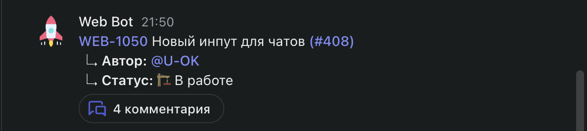
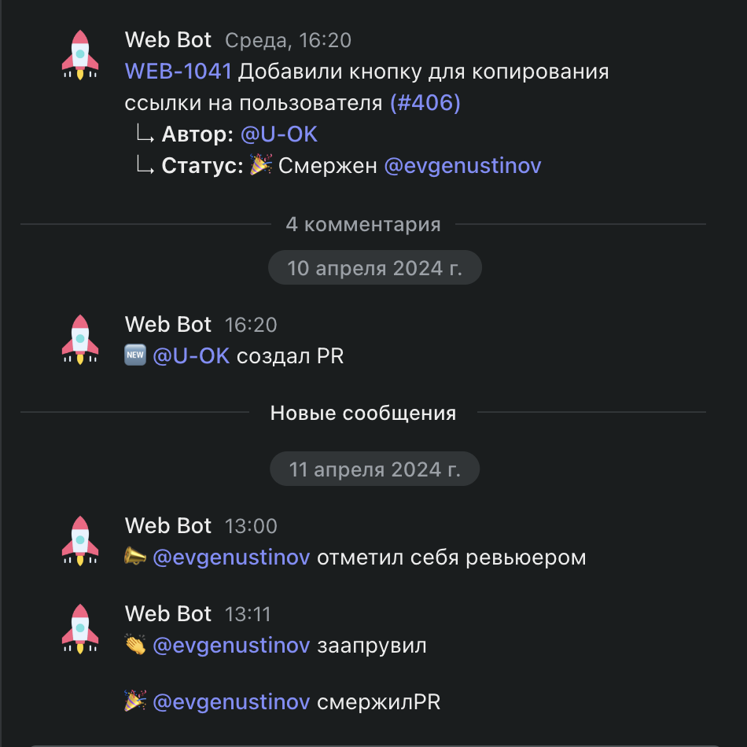
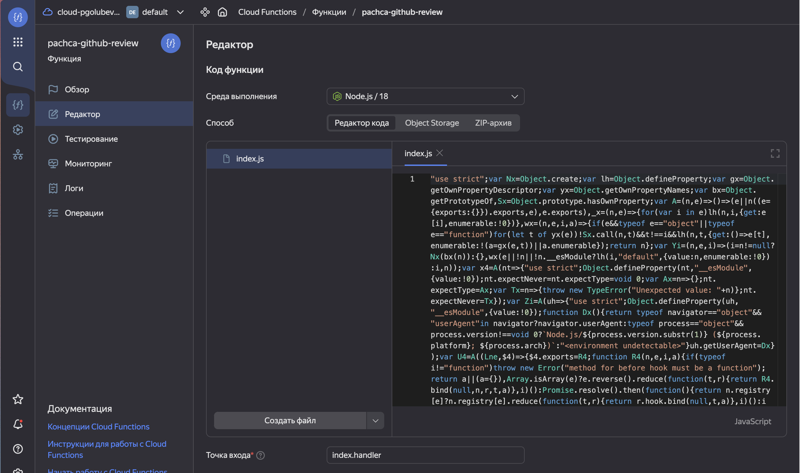
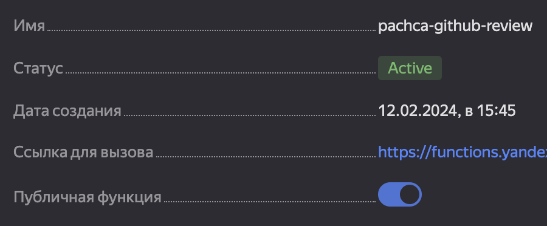

Здесь находится пример интеграции github с [Пачкой](https://pachca.com)

- [Как работает интеграция?](#как-работает-интеграция)
- [Как настроить?](#как-настроить)
  - [Создайте бота в Пачке](#создайте-бота-в-пачке)
  - [Включите вебхуки в github репозитории](#включите-вебхуки-в-github-репозитории)
  - [Получите токен авторизации в Github REST API](#получите-токен-авторизации-в-github-rest-api)
  - [Скачайте код интеграции или модифицируйте и соберите свою версию](#скачайте-код-интеграции-или-модифицируйте-и-соберите-свою-версию)
  - [Разместите интеграцию на сервере](#разместите-интеграцию-на-сервере)
    - [Облачная функция яндекс](#облачная-функция-яндекс)
    - [Размещение на своем сервере](#размещение-на-своем-сервере)

## Как работает интеграция?

Когда в вашем репозитории появляется новый PR, бот Пачки создает сообщение в чате со статусом и автором.



Важные изменения в PR пишутся в треде и обновляют статус в родительском сообщении.



> ✏️ Используйте одинаковые никнеймы в github и Пачке, тогда в сообщениях будут подсвечиваться нужные пользователи.

## Как настроить?

### Создайте бота в Пачке

Чтобы создать нового чат-бота, вам необходимо:

- Перейти в раздел «Автоматизации» → «Интеграции»
- Найти в списке блок «Чат-боты и вебхуки»
- В настройках создать нового бота. Например, с именем "Backend review"
- Для получения access_token вам необходимо перейти во вкладку «API» в настройках бота
- Добавьте этого бота в чат, в котором вы хотите получать уведомления по ревью. Запишите chat_id, он понадобится при [размещении на сервере](#разместите-интеграцию-на-сервере).

### Включите вебхуки в github репозитории

1. Переходим в репозиторий -> Settings -> Webhooks -> Add webhook
2. Указываем url, на который будут приходить вебхуки. Подробнее в разделе [Разместить интеграцию на сервере](#разместите-интеграцию-на-сервере)
3. Указываем Content type: application\json
4. Выбираем Let me select individual events и отмечаем чекбоксами:
   1. Pull requests
   2. Pull request reviews
   3. Workflow runs

[Подробная документация github по настройке вебхуков](https://docs.github.com/en/webhooks/using-webhooks/creating-webhooks)

### Получите токен авторизации в Github REST API

PR и Тред Пачки должны быть связаны между собой. Для этого интеграция при создании PR отправляет комментарий со ссылкой на тред Пачки.

- [Убедитесь, что в организации разрешено использовать fine-grained personal access tokens](https://docs.github.com/en/organizations/managing-programmatic-access-to-your-organization/setting-a-personal-access-token-policy-for-your-organization)
- Создайте нового пользователя с доступом к нужному репозиторию. Дайте ему имя, например, "Бот Пачки". В настройках этого пользователя создайте [fine-grained personal access token для нужного репозитория организации](https://docs.github.com/en/authentication/keeping-your-account-and-data-secure/managing-your-personal-access-tokens#creating-a-fine-grained-personal-access-token)
- Среди repository permissions выберите
  - Actions (Read-only)
  - Pull Requests (Read and write)
- Сохраните токен, а также логин пользователя. Эти данные понадобятся при конфигурации

[Подробная документация github по способам авторизации REST API](https://docs.github.com/en/rest/authentication/authenticating-to-the-rest-api?apiVersion=2022-11-28)

### Скачайте код интеграции или модифицируйте и соберите свою версию

В [разделе releases](https://github.com/pachca/review-bot/releases/latest) лежит готовый index.js файл для node18+, который будет работать в [облачной функции Яндекс](#облачная-функция-яндекс)

Также вы можете отредактировать index.ts под свои нужны и собрать файл самостоятельно.

```bash
npm i
npm run build
```

> ✏️ Используйте [bun](https://bun.sh/) вместо npm\node, чтобы работать напрямую index.ts без этапа сборки.

### Разместите интеграцию на сервере

#### Облачная функция яндекс

При этом способе не нужно поддерживать работу собственного сервера. Яндекс Облако предоставляет бесплатно 1млн вызовов функции в месяц, что более чем достаточно для бота.

1. [Воспользуйтесь инструкцией по созданию функции](https://yandex.cloud/ru/docs/functions/quickstart/create-function/node-function-quickstart)
2. Добавьте файл index.js в вашу функцию 
3. Точка входа index.handler
4. Добавьте переменные окружения для функции
   1. GITHUB_ACCESS_TOKEN - [access_token пользователя с доступом к репозиторию и rest-api](#получите-токен-авторизации-в-github-rest-api)
   2. GITHUB_USER_LOGIN - [логин пользователя в github, чей access_token вы получили](#получите-токен-авторизации-в-github-rest-api)
   3. GITHUB_OWNER - название организации. Например, для текущего репозитория https://github.com/pachca/review-bot - это pachca
   4. GITHUB_REPO - название организации. Например, для текущего репозитория https://github.com/pachca/review-bot - это review-bot
   5. PACHCA_API_ACCESS_TOKEN - [access_token бота в Пачке](#создайте-бота-в-пачке)
   6. PACHCA_CHAT_ID - [чат Пачки, в котором будут создаваться сообщения](#создайте-бота-в-пачке). Бот должен быть участником этого чата.
5. Сохраните изменения
6. В разделе "Обзор" функции сделайте ее публичной
7. Затем скопируйте Ссылку для вызова и укажите ее в [вебхуках репозитория](#включите-вебхуки-в-github-репозитории)
   

#### Размещение на своем сервере

Переместите содержимое `module.exports.handler` внутрь функции вашего веб-сервера и замените возвращаемые ответы на подходящий формат.
